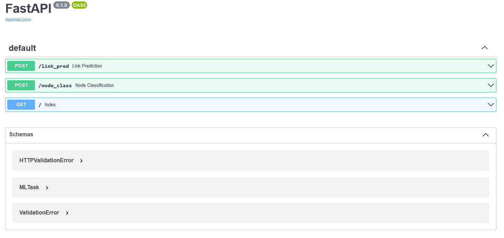
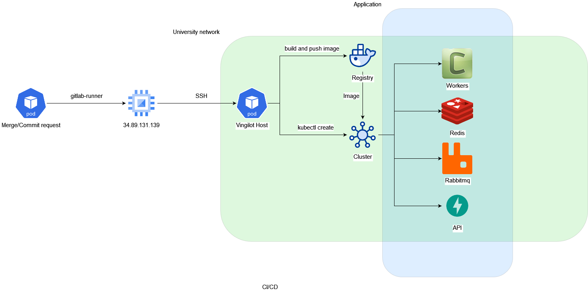
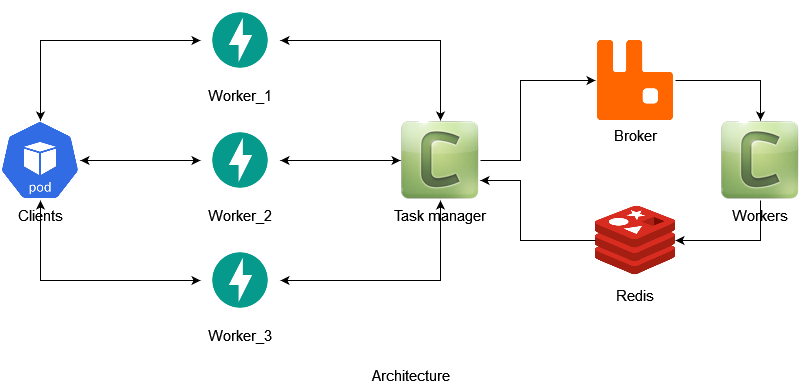

### Installation
#### Local

install [conda](https://docs.conda.io/projects/conda/en/latest/user-guide/install/index.html)

clone the repo
```shell
git clone git@gitlab2.informatik.uni-wuerzburg.de:xtai_lab2/xtai_lab3.git
cd xtai_lab3/backend/ml
```

create new environment
```shell
conda env create --file requirements.yaml --name <env_name>
```

activate environment
```
conda activate <env_name>
```

install [docker](https://docs.docker.com/engine/install/ubuntu/) and [docker-compose](https://docs.docker.com/compose/install/)

start [redis](https://redis.io/) and [rabbitmq](https://www.rabbitmq.com/)
```shell
docker-compose -f deployment/development/docker-compose.yaml up -d
```

Add environmental variables to the `.env` file in the root of this project

```shell
REDIS_HOST=localhost
REDIS_PORT=6379
RABBITMQ_HOST=localhost
RABBITMQ_PORT=5672
RABBITMQ_USER=guest
RABBITMQ_PASSWORD=guest
```

start task manager workers
```shell
celery -A task_manager.tasks worker
```

start the web application
```shell
uvicorn app:create_app --factory
```

Root path `/` will be redirected to `/docs` where you can play around with endpoints




#### Global
See details about CI/CD in [.gitlab-ci.yml](../../.gitlab-ci.yml) and in [deployment/global](deployment/global)



### Architecture



### Gitlab-runner

To run a gitlab runner on the host you want you will need to

- move `deployment/gitlab_runner` directory on the host
- create `deployment/gitlab_runner/gitlab_runner_config` directory which is the volume for configs
- move config for docker runner to `deployment/gitlab_runner/gitlab_runner_config/config.toml`
- run the container with runner
```shell
cd deployment/gitlab_runner && docker-compose up --build -d
```
- if you start the runner at first time you will need to attach the service
```shell
docker-compose exec gitlab-runner bash
```
- then you will need to register the runner in the interactive tty by following the instructions
```shell
gitlab-runner register
```
It will create a file `deployment/gitlab_runner/gitlab_runner_config/config.toml`
You will need to restart the service
```shell
docker-compose down
docker-compose up --build -d
```